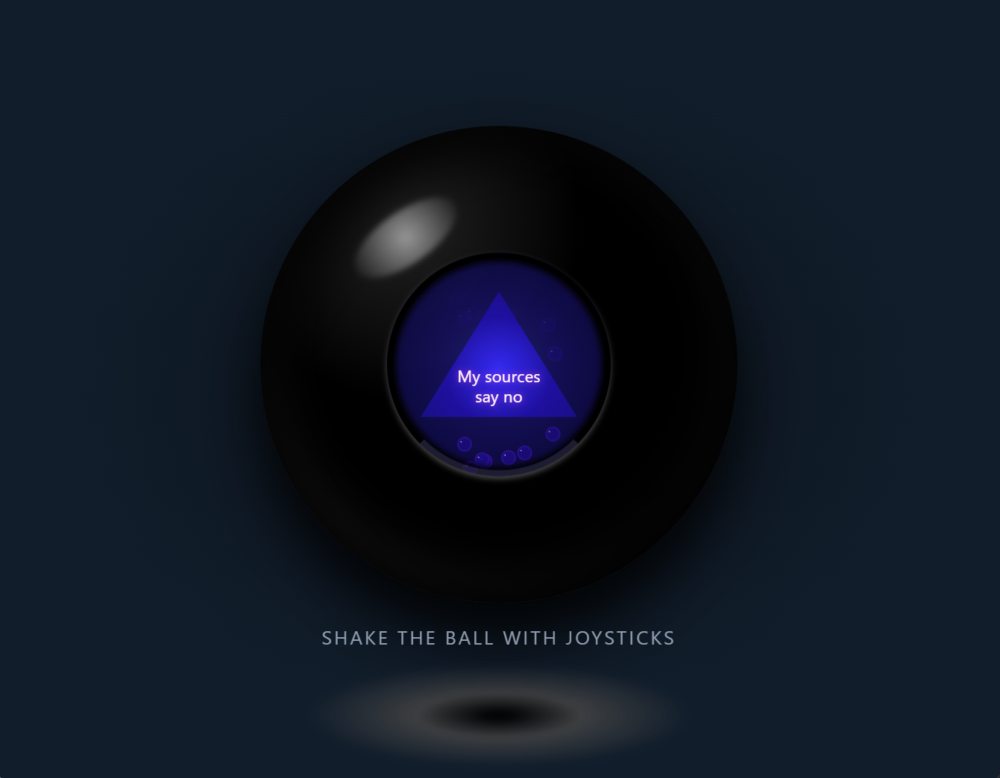

# Ask the Orb 🎱



A small game built at [The Recurse Center](https://recurse.com) for the [RCade](https://rcade.recurse.com) by [Nadia Heredia](https://github.com/nadia-nh), and [Eliza Gilpin](https://github.com/elizathescheisse).

Concentrate hard on your yes-no question and shake the joysticks to let the 8-ball reveal an answer.

Original 8-ball prototype built by Eliza, ported to the RCade.

## About RCade

This game is built for [RCade](https://rcade.recurse.com), a custom arcade cabinet at The Recurse Center. Learn more about the project at [github.com/fcjr/RCade](https://github.com/fcjr/RCade).

## Getting Started

Install dependencies:

```bash
npm install
```

Start the development server:

```bash
npm run dev
```

This launches Vite on port 5173 and connects to the RCade cabinet emulator.

## Building

```bash
npm run build
```

Output goes to `dist/` and is ready for deployment.

## Project Structure

```
├── public/           # Static assets (copied as-is)
├── src/
│   ├── sketch.js     # p5.js sketch (game code)
│   └── style.css     # Styles
├── index.html        # HTML entry
├── vite.config.js    # Vite configuration
└── package.json
```

## Adding Assets

**Imported assets** (recommended) - Place in `src/` and import them. Vite bundles these with hashed filenames for cache busting:

```js
import spriteUrl from './sprite.png';

let sprite;

p.preload = () => {
    sprite = p.loadImage(spriteUrl);
};

p.draw = () => {
    p.image(sprite, x, y);
};
```

**Static assets** - Place in `public/` for files copied as-is. Access via root path (`/sprite.png`).

## p5.js Basics

The template uses p5.js in [instance mode](https://github.com/processing/p5.js/wiki/Global-and-instance-mode):

```js
import p5 from "p5";

const sketch = (p) => {
    p.setup = () => {
        p.createCanvas(336, 262);  // RCade dimensions
    };

    p.draw = () => {
        p.background(26, 26, 46);
        p.fill(255);
        p.ellipse(p.width / 2, p.height / 2, 50, 50);
    };
};

new p5(sketch, document.getElementById("sketch"));
```

## Arcade Controls

This template uses `@rcade/plugin-input-classic` for arcade input:

```js
import { PLAYER_1, SYSTEM } from '@rcade/plugin-input-classic'

// D-pad
if (PLAYER_1.DPAD.up) { /* ... */ }
if (PLAYER_1.DPAD.down) { /* ... */ }
if (PLAYER_1.DPAD.left) { /* ... */ }
if (PLAYER_1.DPAD.right) { /* ... */ }

// Buttons
if (PLAYER_1.A) { /* ... */ }
if (PLAYER_1.B) { /* ... */ }

// System
if (SYSTEM.ONE_PLAYER) { /* Start game */ }
```

## RCade Screen Size

The RCade cabinet uses a 336x262 pixel display. The template is pre-configured with these dimensions.

## Deployment

First, create a new repository on GitHub:

1. Go to [github.com/new](https://github.com/new)
2. Create a new repository (can be public or private)
3. **Don't** initialize it with a README, .gitignore, or license

Then connect your local project and push:

```bash
git remote add origin git@github.com:YOUR_USERNAME/YOUR_REPO.git
git push -u origin main
```

The included GitHub Actions workflow will automatically deploy to RCade.

---

Made with <3 at [The Recurse Center](https://recurse.com)
